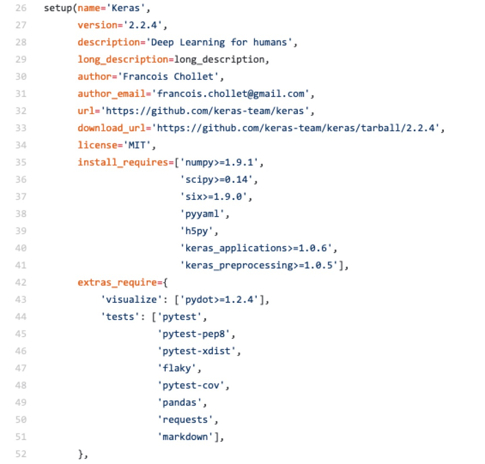
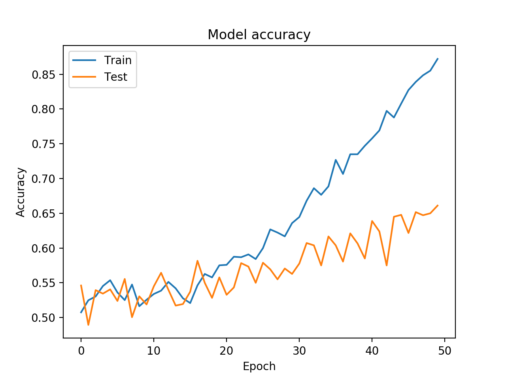
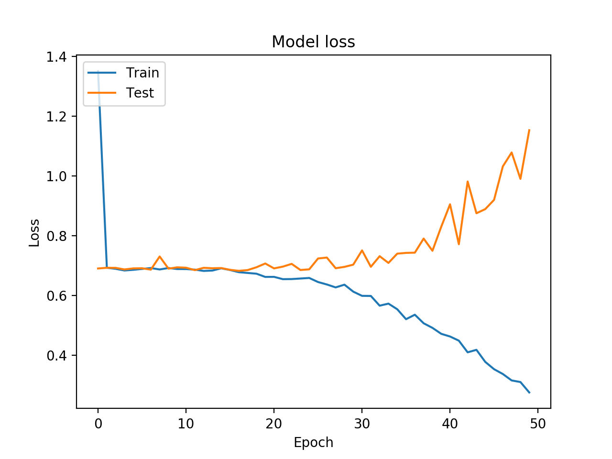
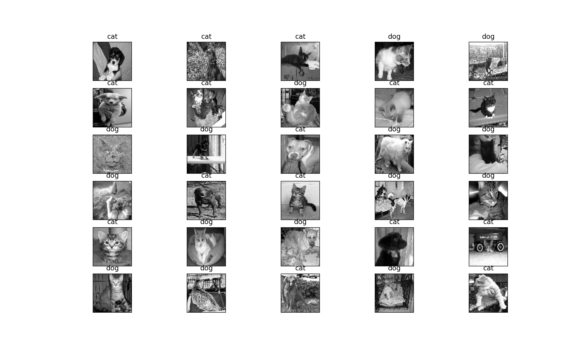

# case-study-zywan-Keras    
Analyze the package in your own words, 5-10 pages total, a concise analysis without vague generalities, including the following.     
## Technology and Platform used for development
1. What coding languages are used? Do you think the same languages would be used if the project was started today? What languages would you use for the project if starting it today?        
The coding language that keras uses is python.        
Keras is one of the most powerful and easy-to-use Python libraries for developing and evaluating deep learning models;          
It wraps the efficient numerical computation libraries Theano and TensorFlow.        
I think the reason why Keras use python is the same as the reason why using python for machine/deep learning. The main reason are following:     
(1) If we look at the philosophy of the Python language, we can say that this language was built for its readability and less complexity. we can easily understand it and make someone understand very fast.           
(2) Machine learning is to use the data to make a machine make intelligent decision. An important task of a Machine learning engineer in his/her work life is to extract, process, define, clean, arrange and then understand the data to develop intelligent algorithms. sometimes the concept of linear Algebra, calcucas are so that they take the maximum amount of effort. So a quick implementation in Python helps a ML developer to validate an idea.           
(3) There are collection and code stack of various open source repositories which is developed by people to continuously improve upon the existing methods.         

2. What build system is used (e.g. Bazel, CMake, Meson)? What build tools / environment are needed to build (e.g. does it require Visual Studio or just GCC or ?)        
 
 
3. What frameworks / libraries are used in the project? At least one of these projects don’t use any external libraries or explicit threading, yet is noted for being the fastest in its category--in that case, what intrinsic language techniques is it using to get this speed.     
Keras itself is a framework for building deep neural networks with Python. It is designed to build a deep neural network with a few lines of code to avoid complexity.
For the libraried that Keras uses, we can get the information from the setup.py

## Testing: describe unit/integration/module tests and the test framework
1. How are they ensuring the testing is meaningful? Do they have code coverage metrics for example?      

2. What CI platform(s) are they using (e.g. Travis-CI, AppVeyor)?     

3. What computing platform combinations are tested on their CI? E.g. Windows 10, Cygwin, Linux, Mac, GCC, Clang     

## Software architecture
1. How would you add / edit functionality if you wanted to? How would one use this project from external projects, or is it only usable as a standalone program?       

2. What parts of the software are asynchronous (if any)?    

3. Please make diagrams as appropriate for your explanation        

4. How are separation of concerns and information hiding handled?        

5. What architectural patterns are used         

6. Does the project lean more towards object oriented or functional components      

## Analyze two defects in the project
1. Does the issue require an architecture change, or is it just adding a new function or?      

2. make a patch / pull request for the project to fix problem / add feature      

## Demonstration application of the system   
### Background
image classification of two classes of objects-- dogs and cats    
### Demo Results
#### Accuracy

#### Loss

#### one classification example

