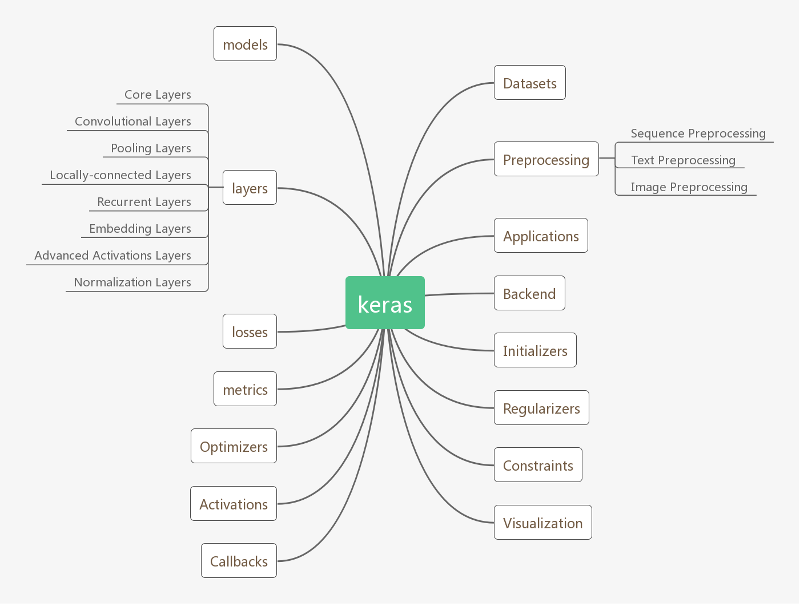

# case-study-zywan-Keras    
Analyze the package in your own words, 5-10 pages total, a concise analysis without vague generalities, including the following.     
## Technology and Platform used for development
#### 1. What coding languages are used? Do you think the same languages would be used if the project was started today? What languages would you use for the project if starting it today?
The coding language that keras uses is python.        
Keras is one of the most powerful and easy-to-use Python libraries for developing and evaluating deep learning models;          
It wraps the efficient numerical computation libraries Theano and TensorFlow.        
I think the reason why Keras use python is the same as the reason why using python for machine/deep learning. The main reason are following:     
(1) If we look at the philosophy of the Python language, we can say that this language was built for its readability and less complexity. we can easily understand it and make someone understand very fast.           
(2) Machine learning is to use the data to make a machine make intelligent decision. An important task of a Machine learning engineer in his/her work life is to extract, process, define, clean, arrange and then understand the data to develop intelligent algorithms. sometimes the concept of linear Algebra, calcucas are so that they take the maximum amount of effort. So a quick implementation in Python helps a ML developer to validate an idea.           
(3) There are collection and code stack of various open source repositories which is developed by people to continuously improve upon the existing methods. 
#### 2. What build system is used (e.g. Bazel, CMake, Meson)? What build tools / environment are needed to build (e.g. does it require Visual Studio or just GCC or ?)   
Cmake and Bazel.          
GCC and NVIDIA CUDA Compiler(NVCC) are needed for GPU acceleration.     

#### 3. What frameworks / libraries are used in the project? At least one of these projects don’t use any external libraries or explicit threading, yet is noted for being the fastest in its category--in that case, what intrinsic language techniques is it using to get this speed. 

Keras itself is a framework for building deep neural networks with Python. It is designed to build a deep neural network with a few lines of code to avoid complexity.
For the libraried that Keras uses, we can get the information from the setup.py


## Testing: describe unit/integration/module tests and the test framework
#### 1. How are they ensuring the testing is meaningful? Do they have code coverage metrics for example?    
yes, they do have code coverage metrics, they have a .coveragerc file  
#### 2. What CI platform(s) are they using (e.g. Travis-CI, AppVeyor)?     
They use Travis-CI platform to do the following test:         
Integration test:     
preprocessing --> sequence test, text test, image test
application test     
imageNet utils test      
dataset test       
image data task test      
tensorflow integration test     
Keras functional test:       
backend test     
engine test      
layer test      
legacy test      
utils test      
wrapper test      
multiprocessing test and so on  
#### 3. What computing platform combinations are tested on their CI? E.g. Windows 10, Cygwin, Linux, Mac, GCC, Clang  
Windows 10, Linux, Mac
      
## Software architecture
#### 1. How would you add / edit functionality if you wanted to? How would one use this project from external projects, or is it only usable as a standalone program?    
Keras can be used from external projects, the only thing that you need to do is import the necessary libraries to the program.  
Keras provides common used neural network layer, optimizers,loss functions drop out, activiate function, pooling and so on. Users can design their own models, but not in a free way like in Tensorflow and Pytorch, which means there are some restriction while using Keras.   

#### 2. What parts of the software are asynchronous (if any)?    
Keras is synchronous.   
#### 3. Please make diagrams as appropriate for your explanation      
         
one use case diagram for multiple input:              
  
#### 4. How are separation of concerns and information hiding handled?        
#### 5. What architectural patterns are used   
The achitectural pattern that Keras mainly use is layered pattern and Pipe-filter pattern.    
#### 6. Does the project lean more towards object oriented or functional components                       
The project lean more towards functional components. The codes are basically gatherd by functions instead of class, so I think it is more like functional components.         

## Analyze two defects in the project
1. Does the issue require an architecture change, or is it just adding a new function or?      
2. make a patch / pull request for the project to fix problem / add feature      
Adding feature  #10890       
1) Add Dice Loss: Dice Score/Loss (also known as F1-score or Sorensen score) should be added as a metric and loss function as these are very commonly used in image segmentation or bounding box problems.       
2) Linear Chain Conditional Random Field  #4090      
Linear Chain CRF layer for sequence tagging tasks.          
## Demonstration application of the system   
### Background
Image classification of two classes of objects-- dogs and cats      
Accoring to the results, there exists overfitting.    
Overfitting is a common phenomenon in DL/ML, since it is usual to have great performance in trainning but have poor performance in testing. Usage of Drop out, early stop and using bigger data set can prevent the overfitting in some way.          
### model
```python
# build a model which have 3 convolution layers
model = Sequential()

model.add(InputLayer(input_shape=[64,64,1]))
model.add(Conv2D(filters=32,kernel_size=5,strides=1,padding='same',activation='relu'))
model.add(MaxPool2D(pool_size=5,padding='same'))

model.add(Conv2D(filters=50,kernel_size=5,strides=1,padding='same',activation='relu'))
model.add(MaxPool2D(pool_size=5,padding='same'))

model.add(Conv2D(filters=80,kernel_size=5,strides=1,padding='same',activation='relu'))
model.add(MaxPool2D(pool_size=5,padding='same'))

model.add(Dropout(0.25))
model.add(Flatten())
model.add(Dense(512,activation='relu'))
model.add(Dropout(0.5))
model.add(Dense(2,activation='softmax'))
optimizer = Adam(lr=1e-4)
```
### Demo Results
#### Accuracy

#### Loss

#### one classification example

